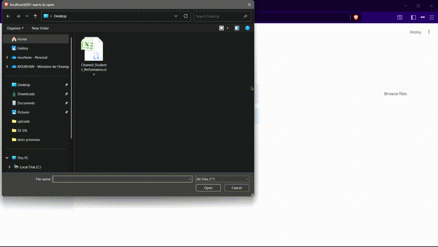

# Analyste

**Dataset Analyzer** is an interactive Python tool for exploring and querying datasets. It automatically generates analysis plans, produces interactive visualizations, and leverages a large language model (LLM) to provide natural language insights. Upload a dataset, preview it, ask questions, and get instant textual and graphical results—all in one interactive interface.

## Project Workflow

```
Streamlit UI
   ↓
Agent  (orchestrator)
   ├─ DatasetManager       # load/cast/clean/cached pandas.DataFrame + summary
   ├─ IndexManager         # create / update vector index (LlamaIndex + Chroma)
   ├─ Planner              # LLM -> structured plan (JSON) of compute/visualize/answer steps
   ├─ Executor             # performs compute steps on DataFrame (corr, agg, filter...)
   ├─ Visualizer           # creates matplotlib/plotly figures (returned to UI)
   └─  LLM         (llm.py) # wrapper for local model (qwen2.5.gguf)
```

---

## Demo

Here is the agent in action, don't hesistate to try it yourself anyways!


